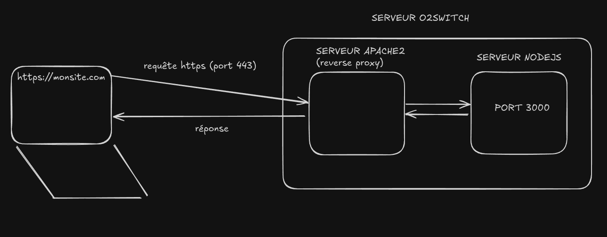
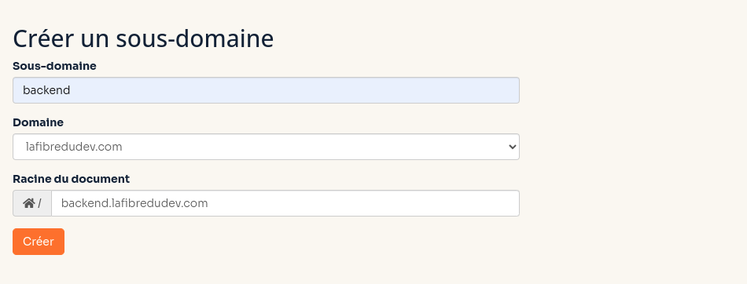
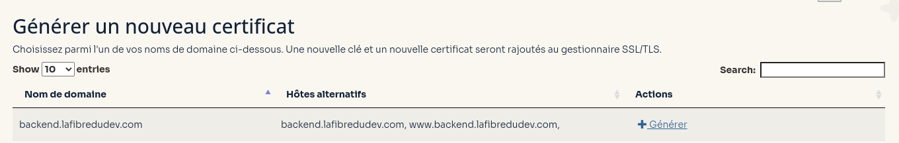
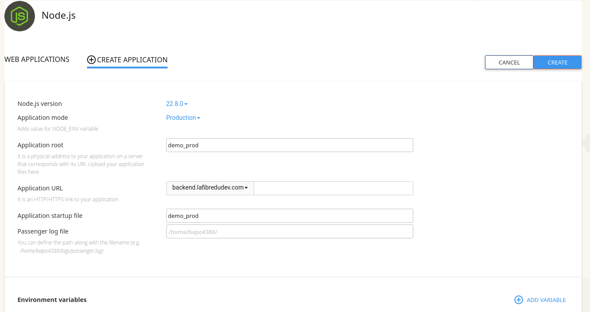
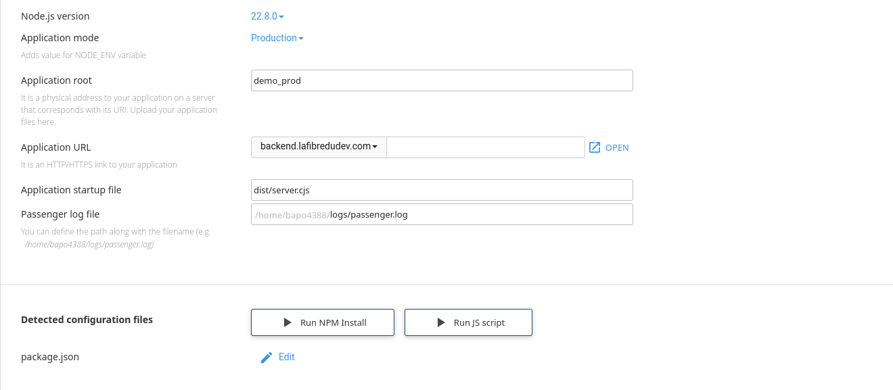

# Déploiement

Déploiement d'une application Node.js sur o2switch

- Tu sais créer un projet NodeJS avec Express ?
- T'aimerais le déployer sur o2switch sans trop de difficultés ?

On va voir tout ça dans cette vidéo !

---

## Prérequis

- Avoir commandé un espace d'hébergement sur o2switch
- Avoir configuré sa clé SSH pour se connecter sur le serveur
- Avoir associé une clé SSH de son serveur à son compte Github
- Savoir manipuler le terminal

--

## O2Switch et Phusion Passenger

- o2switch est un serveur mutualisé
- o2switch utilise un système qui s'appelle **Fusion Passenger**

--

## Présentation

Phusion Passenger est un **serveur d'applications web moderne** qui **simplifie le déploiement, la gestion et la performance des applications web**. Connu pour sa robustesse, sa facilité d'intégration et ses performances élevées, Passenger est particulièrement prisé pour les applications **Ruby, Python et Node.js**. Il est compatible avec les serveurs HTTP comme Nginx et Apache, offrant ainsi une grande flexibilité aux développeurs et administrateurs système.

--

## Un petit schéma pour comprendre

Toute l'installation technique se fait en quelques clics sur une interface graphique (CPANEL).



--

## Les problématiques à résoudre

- O2switch fournit un environnement mutualisé avec des versions spécifiques de Node.js
- Contrairement à un VPS, l'exécution de processus Node.js **est limitée sur un hébergement mutualisé**
- La version actuelle de Phusion passenger ne gère donc pas les **import** d'un script NodeJS (Ecmascript)
- Il nous faut **builder** notre application NodeJS pour la rendre compatible en **commonJS**

---

### Préparation du projet en local

Créez une application avec `vite-node` :

```bash
npm create vite@latest my-app --template vite-node
cd my-app
npm install
```

--

### Configurez le script de démarrage dans `package.json`

```json
"scripts": {
    "build": "vite build",
    "start": "node dist/server.cjs",
}
```

--

### Configure bien ton fichier vite.config.js

On va faire en sorte que les fichiers du dossier **dist** aient comme extension `<fichier>.cjs`.

```js
import { defineConfig } from 'vite';

export default defineConfig({
  optimizeDeps: {
    // si t'utilises express
    include: ['express'],
  },
  build: {
    // dossier de build
    outDir: 'dist', 
    // options du build
    rollupOptions: {
        output: {
            format: 'cjs', 
            entryFileNames: '[name].cjs',
        },
    },
  },
});
```

--

### Particularité avec un projet express

Rajoute le wrapper spécifique à o2switch

```js
import express from 'express';

if (typeof(PhusionPassenger) !== 'undefined') {
    PhusionPassenger.configure({ autoInstall: false });
}
 
var app = express();
app.get('/', function(req, res) {
    var body = 'Hello World';
    res.setHeader('Content-Type', 'text/plain');
    res.setHeader('Content-Length', body.length);
    res.end(body);
});
 
if (typeof(PhusionPassenger) !== 'undefined') {
    app.listen('passenger');
} else {
    app.listen(3000);
}
```

--

### Testez localement

```bash
# pour démarrer le projet en mode dev
npm start
# pour build ton application nodejs
npm build
```

Assure-toi que le build fonctionne correctement !

--

### 3. Envoyer tes sources sur Github

- il faut au préalable avoir initialisé ton projet avec **git init**, le relier à github
- avoir fait les commandes **git add .** et **git commit -m "mon message"**
- assure toi avant que le dossier dist est bien envoyé sur github
- vérifie pour cela le fichier .gitignore

```bash
git push
```

---

### Connexion à cPanel

Connecte-toi à l'espace cPanel de ton hébergement o2switch.

--

### Gestion des Domaines

Ajoute un sous-domaine pour ton application Node.js.



--

### Création de ton certificat HTTPS



--

### Connexion en SSH et récupération des sources

```bash
ssh <serveur prod>
[monserveurprod]$ git clone <monrepo>
```

On pourrait aussi envoyer les fichier par FTP, mais c'est plus fastidieux !

--

### Installation de l'application NodeJS sur le CPANEL



--

### Lance le script npm install depuis CPANEL



N'hésite pas à restart ton App NodeJS une fois que c'est fait !

--

### Architecture du serveur

```bash
dossier <HOME>
 |
 |----->dossier <backend.lafibredudev.com> # contient les fichiers Apache2
 |
 |----->dossier <my_app> # contient les sources NodeJS
```

--

### Activer le mode Debug

En cas d'erreurs, la page d'erreur qui s'affiche (dans le navigateur web) ne contient pas beaucoup d'information par défaut. Il est possible d'activer le mode de debug avancé de Phusion Passenger, la page d'erreur générée sera beaucoup plus complète.

- Pour cela, il suffit d'ajouter les lignes suivantes dans le fichier .htaccess à la racine du site internet (attention, il s'agit du dossier Apache2 et non celui de NodeJS) :

```bash
PassengerAppEnv development
PassengerFriendlyErrorPages on
```

---

## Bonnes Pratiques

1. **Optimisation des Performances**  
   Minimisez les dépendances et utilisez des outils comme `vite` pour servir les assets statiques (fichiers minifiés).

2. **Sécurité**  
   Protégez vos fichiers sensibles comme `.env`.

3. **Surveillance**  
   Configurez des outils de monitoring pour suivre les performances et les erreurs.

--

### Explore la documentation et mon repo d'exemple

Mon repo est accessible ici :
[https://github.com/LaFibreDuDev/demo-deploy-fullstack-o2switch](https://github.com/LaFibreDuDev/demo-deploy-fullstack-o2switch)

La documentation est accessible ici :
[https://faq.o2switch.fr/hebergement-mutualise/tutoriels-cpanel/app-nodejs](https://faq.o2switch.fr/hebergement-mutualise/tutoriels-cpanel/app-nodejs)

Je te mets le lien en description de la vidéo.

--

### Conclusion

Avec ces étapes, vous devriez être prêt à déployer une application Node.js sur o2switch avec succès. Bon déploiement !
