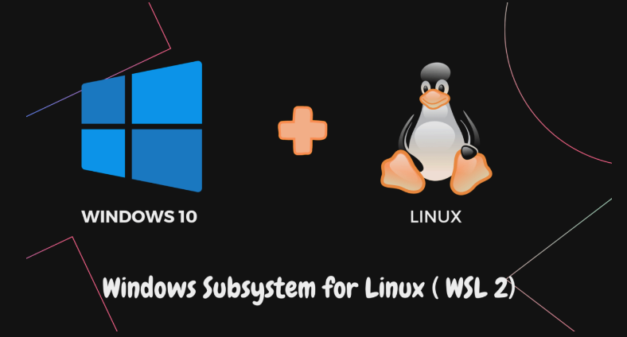
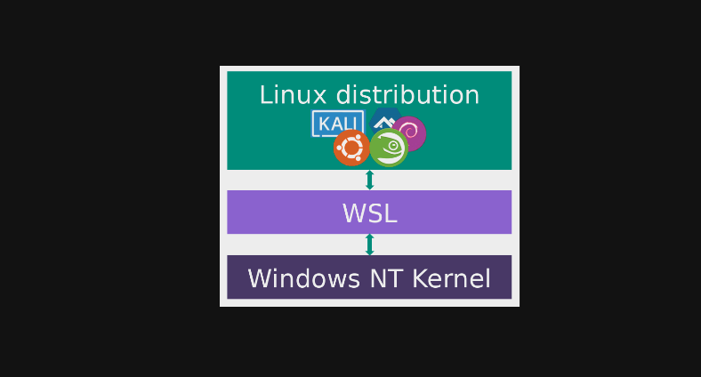
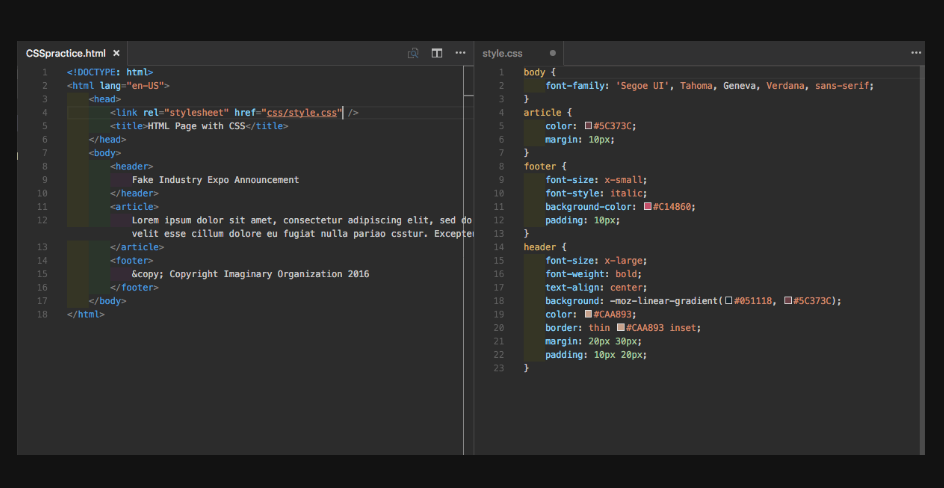
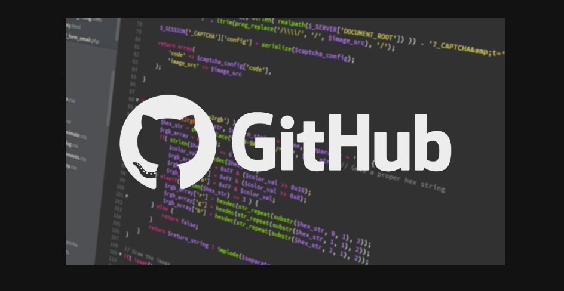
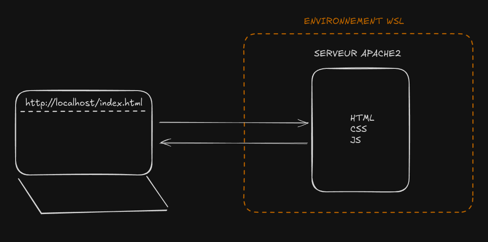
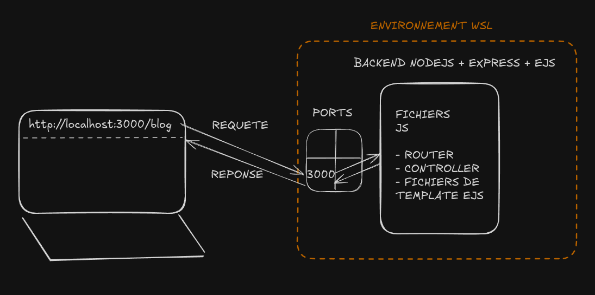
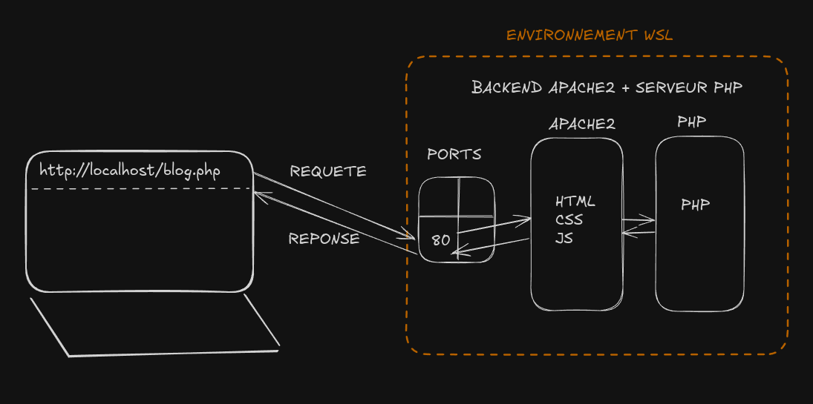
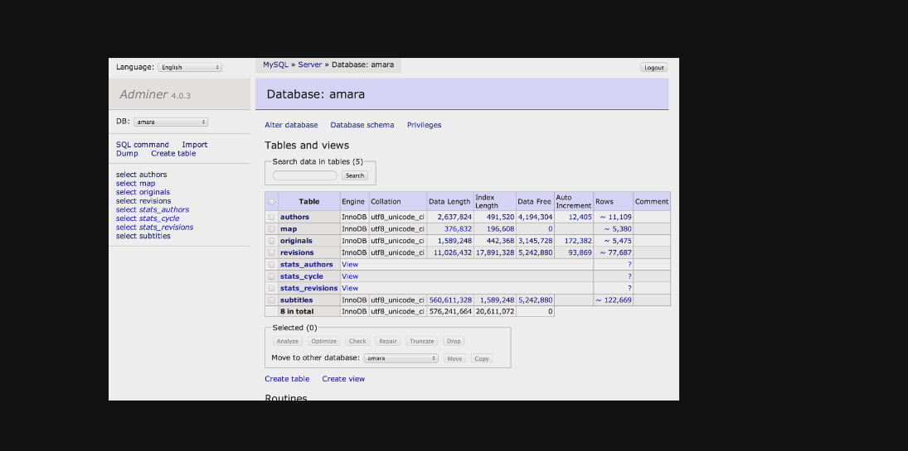

# Créer son site avec WSL en 2025 ?

- Comment utiliser Windows en 2025 pour développer un site Internet, grâce à WSL (Windows SubSystem Linux)
- Toutes les vidéos sont des tutoriels pour installer l'environnement

--

## Petits rappels

N'oublie pas de t'abonner à la chaîne Youtube !  
Hésite pas à commenter si t'es hypé par cette série :)

--

## Prérequis

- Savoir manipuler la ligne de commandes (terminal)

--

### Vidéo 1 - WSL

- Comment installer WSL sur un système Windows 10 ou Windows 11 ?
- Comment faire les mises à jour du système WSL ?

--

### Vidéo 2 - VSCODE

- Comment installer VS CODE sur Windows ?
- Comment ouvrir un projet VS CODE en utilisant WSL ?

--

### Vidéo 3 - GITHUB

- Comment lier sa clé GIT à GITHUB dans l'environnement WSL ?

--

### Vidéo 4 - FRONTEND

- Comment installer un serveur statique pour délivrer du HTML/CSS/JS dans WSL ?
  - Choix du serveur : Apache 2

--

### Vidéo 5 - BACKEND JS

- Comment installer le serveur NodeJS et le gestionnaire de dépendance npm/pnpm ?
  - On verra comment le faire via nvm

--

### Vidéo 6 - BACKEND PHP

- Comment installer le serveur PHP ?
- Comment le faire fonctionner avec le serveur Apache2 pour délivrer des contenus PHP côté client ?

--

### Vidéo 7 - BASE DE DONNEES MYSQL

- Comment installer le serveur MySQL ?
- Comment installer adminer, une interface simple pour accéder aux bases de données ?

--

### Vidéo 8 - BASE DE DONNEES POSTGRESQL

- Comment installer le serveur POSTGRESQL ?
- Comment utiliser adminer pour accéder aux données de la base ?

--

### Vidéo 9 - AUTOMATISATION

- Comment faire en sorte de démarrer automatiquement des services ?
  - Notamment au démarrage de la machine Windows ?
