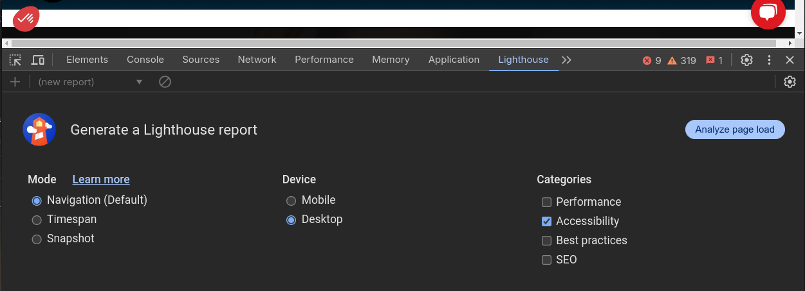
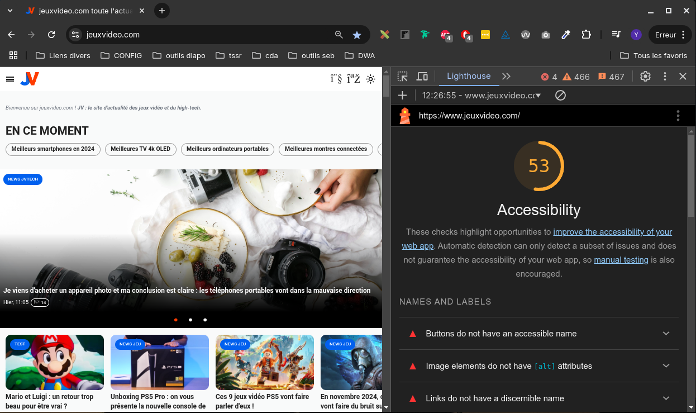
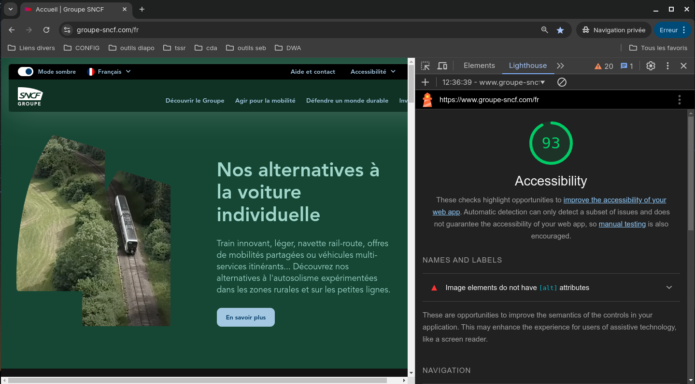
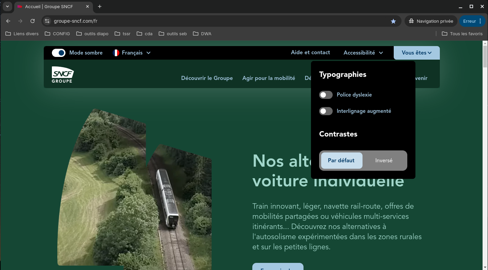
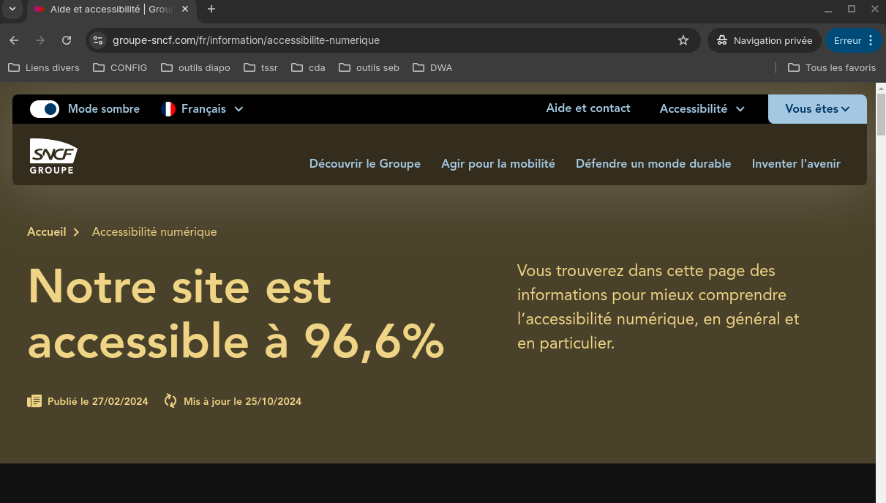
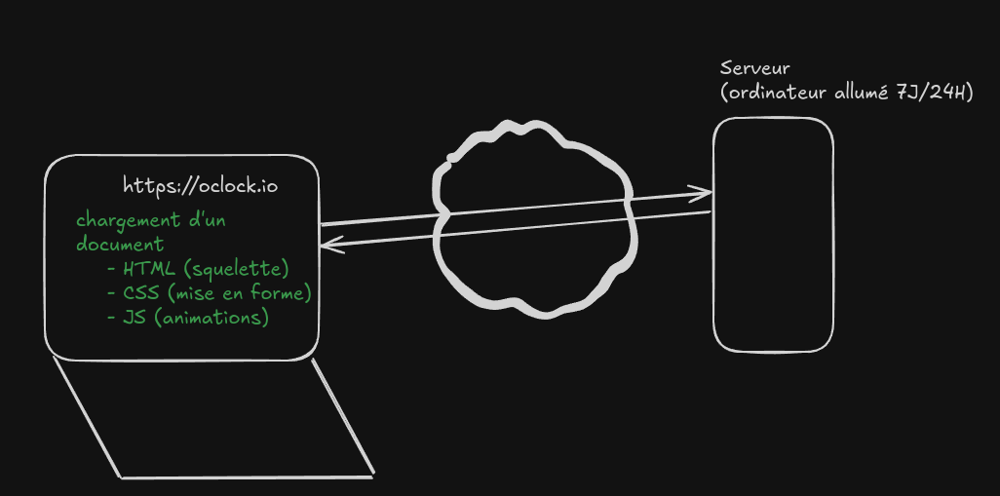
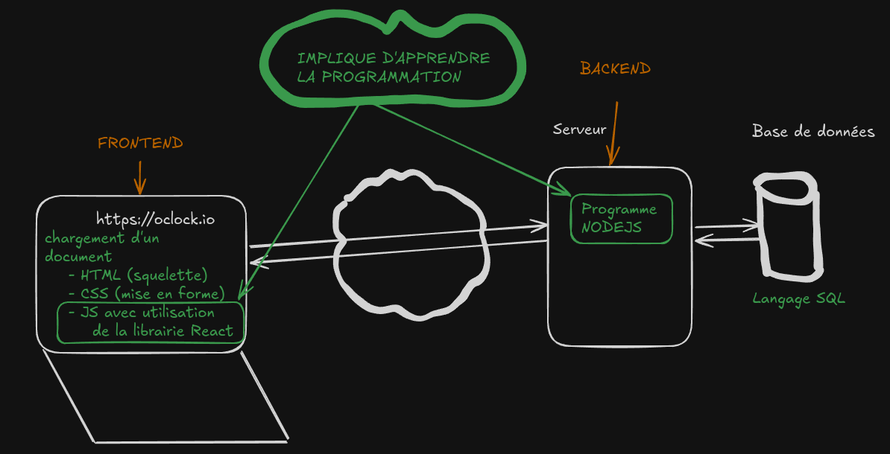
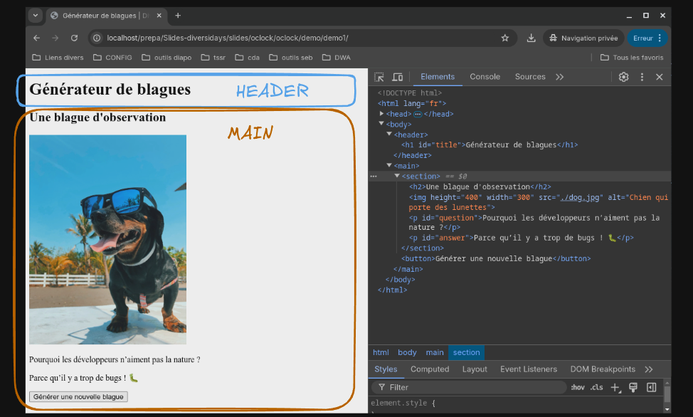
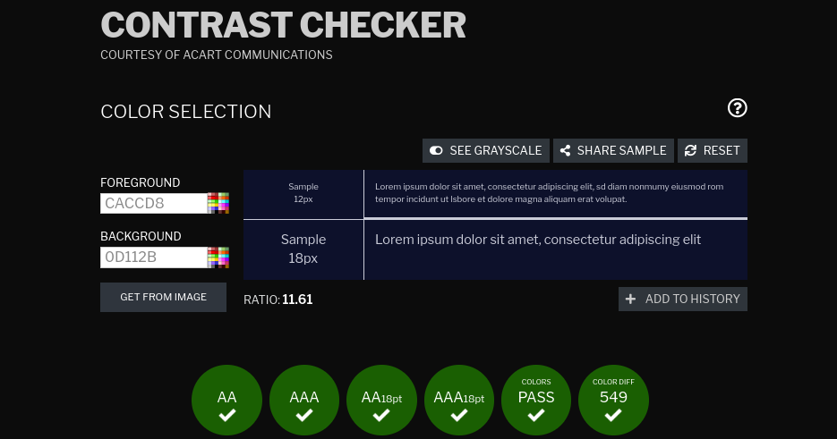
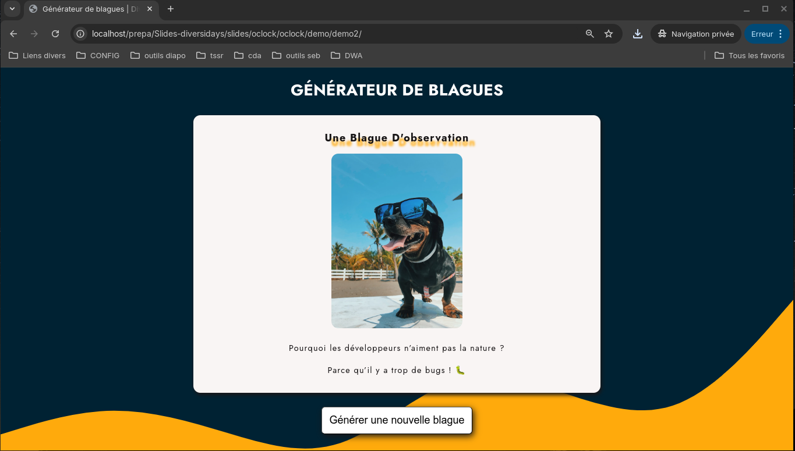

# Diversidays

Introduction à la formation Développeur Web et Accessibilité (DWA).

Présentation du 05/11/2024.

--

### Je me présente, je m'appelle Henri ... :)

- Je m'appelle Yannick KUHN
- J'ai 35 ans
- Je vis en Lorraine (dép 57)
- J'ai un chien
- Je code depuis l'âge de 14 ans
- Je suis développeur/formateur depuis 2 ans 1/2 (DWWM, DWA et TSSR)
- Ma première EXP est un stage fait en 3ème dans une entreprise de dépannage informatique
- J'ai développé mes premiers sites en autodidacte pour des amis (photographie de mariages, cirque, etc.)

--

### La formation DWA, c'est quoi ?

- **Objectif** : Former des développeurs web avec une expertise en accessibilité numérique.
- **Durée** :
  - 7 mois de formation intensive (on parlera des langages après)
  - 2 mois pour créer un projet professionnel tutoré
  - 2 mois de stage

--

### Mais Jammy, c'est quoi l'accessibilité ?

Un enjeu essentiel

- **Chiffres clés** : ~15% de la population mondiale vit avec un handicap.
  - Handicaps visuels (aveugles, malvoyants)
  - Handicaps auditifs (surdité, problèmes auditifs)
  - Handicaps auditifs (paralysie, troubles neuromusculaires)
  - Handicaps moteurs (dyslexie, autisme)

- **Barrières numériques** : Obstacles rencontrés par ces utilisateurs.
- **Accessibilité : un bénéfice pour tous !**
  - Exemple : Sous-titres, contrastes élevés.
  - Meilleure expérience utilisateur, bénéfices pour le SEO et conformité légale.

--

### Tu sais s'il existe des règlementations ?

- **WCAG** (Web Content Accessibility Guidelines) :
  - Référentiel principal pour l'accessibilité numérique.
  - Catégories : Perceptible, Utilisable, Compréhensible, Robuste.
- **Loi française (RGAA) et directives européennes** :
  - Obligation pour les sites publics et grosses entreprises de respecter les normes d’accessibilité.
    - plus de 250 salariés
    - plus de 50 millions d'euros (CA)

---

### Quels sont les outils d'accessibilité disponibles

- Navigation au clavier (sans souris) en appuyant sur TAB/ESPACE/ENTREE
- Lecteurs d'écran - NVDA (Windows)
- Loupes d'écran - Windows Magnifier
- Navigateurs à haut contraste (chrome avec extension Dark Reader)
- Afficheurs braille (lecture tactile pour les personnes malvoyantes, Orbit Reader)

--

### On fait comment pour tester l'accessibilité d'un site ?

Dans un navigateur internet (Chrome), on a des outils (extensions, outils natifs).
Clic droit sur une page, inspecter, et se rendre dans l'onglet **Lighthouse**



--

### Le premier mauvais élève

Voici un exemple de site possédant une mauvaise accessibilité (jeuxvideo.com)



--

### Le bon élève

Voici un exemple de site avec une bonne accessibilité (groupe-sncf)



--

### Un menu d'accessibilité



--

### La police adaptée pour les dyslexies

- La police, c'est le style de texte utilisé sur un site (Arial, Sans-sérif, etc.)


--

### Fiers d'être accessibles, ils l'affichent !



--

### Le test ultime à faire chez soi

Prenez-vous au jeu, prenez n'importe quel site et essayez de naviguer sans jamais utiliser votre souris !

Utilisez uniquement votre clavier et découvrez des fonctionnalités que vous n'auriez même pas soupçonnés (liens d'évitement, navigation fluide entre les items, etc.) !

---

### Petit disclaimer

- Je vais vous faire une petite démo pour vous introduire au sujet !
- Ne cherchez pas à tout comprendre (ni le code, ni la technique)
  - On vous apprend tout pas à pas pendant la formation (c'est le but) !
- N'hésitez pas à poser vos questions
  - On fera une session Q/R après la présentation !

--

### Les outils pour bien développer

- Un environnement adapté (Linux)
- Un terminal
- Un éditeur de code (VS Code)
- Un navigateur internet (Google chrome)

NB : J'utilise Zorin OS (basé sur Ubuntu)

--

### Comment ça marche le web ?



--

### L'approche du développeur fullstack



--

### Les rôles d'un frontend et d'un backend

- Partie frontend (partie visuelle)
  - Interface utilisateur (UI)
  - Accessibilité et expérience utilisateur (UX)
  - Responsive Design (site pour desktop/mobile)
  - Performances
  - SEO (visibilité sur internet)

- Partie backend (partie sombre)
  - Gestion de la base de données
  - Logique serveur
  - Création des APIs
  - Sécurité et authentification
  - Performances

---

## Petite démo

On va essayer de montrer comment développer une mini application (sans chercher à comprendre le code).

On va développer une mini application de blagues !

--

### On commence par le HTML

On va construire un contenu d'une page, comme si on concevait un document sous WORD.

Pour cela, on va avoir des balises HTML

- `<h1> à <h6>` pour des titres de niveau 1 à 6
- `<p>` pour des paragraphes
- `` pour des images
- `<header>, <main>, <footer>` pour ajouter de la sémantique au document

NB: Il faut aider le navigateur à comprendre comment est construit le document. On fait déjà de l'accessibilité avec ces dernières !

--

### Un schéma vaut mieux que milles mots !


--

### Le code HTML

- On crée un fichier `index.html` portant le contenu suivant
- Le contenu de ce document sera **statique** dans un premier temps

```html
<!DOCTYPE html>
<html lang="fr">
<head>
    <meta charset="UTF-8">
    <meta name="viewport" content="width=device-width, initial-scale=1.0">
    <meta name="description" content="Générateur de blague">
    <title>Générateur de blagues | Diversidays</title>
</head>
<body>
    <header>
        <h1 id="title">Générateur de blagues</h1>
    </header>
    <main>
        <section>
            <h2>Une blague d'observation</h2>
            
            <p id="question">Pourquoi les développeurs n’aiment pas la nature ?</p>
            <p id="answer">Parce qu’il y a trop de bugs ! 🐛</p>
        </section>
        <button>Générer une nouvelle blague</button>
    </main>
</body>
</html>
```

--

### Mais Jammy, tu apprends tout ça par coeur ?

Non, fort heureusement ! On utilise des documentations. Par exemple la plus connue, j'ai nommé MDN (de Mozilla). Pour le HTML, CSS et le JS !


--

### Le résultat de cette première page



--

### Petites remarques

- Le HTML s'apprends **en deux semaines minimum**
- On apprends pas tout par coeur
  - On vous apprends à aller lire des documentations
- Vous allez progresser avec de la pratique (2h/jour)
- Les réflexes viennent avec beaucoup de pratique et d'habitudes (Dèv junior VS dèv sénior)
- Votre apprentissage dépends :
  - de votre curiosité
  - de votre détermination
  - de votre capacité à décrocher (éviter les burnouts, faire des pauses, garder un équilibre vie perso/vie pro)

--

### Comment on fait pour le mettre en forme ?

- On va utiliser le langage CSS (Cascading Style Sheet).
- On utilise des sélecteurs pour définir les propriétés à appliquer sur un ou plusieurs éléments.

```css
body {
    background: url("./background.svg");
    color: var(--dark-chocolate);
    background-size: cover;
    
}
h1 {
    font-size: 2.3rem;
    text-transform: uppercase;
    text-align: center;
    font-weight: bold;
    color: white;
}
```

--

### On a même des outils pour nous aider avec les contrastes



--

### Montre-nous le résultat ?

- On a un résultat **statique**, mais le bouton ne réagit pas ...



--

### L'ordinateur est bête !

- Un ordinateur, c'est une machine.
- Elle sait réaliser des opérations, mais il faut tout lui dire
- Le seul langage que les navigateurs (sites web) peuvent utiliser est le JS côté client

NB: Attention, Javascript (JS) n'est pas égal à Java

--

### Comment on fait de la programmation ?

On a la palette utilisé par le développeur (artiste). On apprend à parler une nouvelle langue (comme l'anglais par ex) :

- des variables
  - booléens, nombres, chaines de caractères
- des conditions
- des boucles
- des fonctions
- des classes/objets (POO)
- des modules

NB: Avoir l'esprit logique, pour partir d'un problème et arriver à une solution (en faisant preuve de bon sens). Avec de l'expérience, tout le monde peut le faire !

--

### Un exemple de code JS

- Prérequis : Une bonne **logique** + Apprentissage de la syntaxe
- Rôle du programme : ajouter de l'interactivité. Exemple avec l'agrandissement du texte. Le code sera lu et exécutée dans l'ordre (du haut vers le bas).
- Chaque ligne correspondant à une instruction

```html
<button onclick="increaseFontSize()">Agrandir le texte</button>
<p id="text">Ce texte va être agrandi.</p>

<script>
function increaseFontSize() {
  const text = document.getElementById("text");
  const currentFontSize = text.getPropertyValue('font-size');
  let currentSize = parseFloat(currentFontSize);
  text.style.fontSize = (currentSize + 2) + 'px';
}
</script>
```

--

### Le code JS nécessaire pour notre démo

- On va utiliser une API nous permettant de générer une blague

```js
const blagues = new BlaguesAPI("ey...");

const question = document.querySelector("#question");
const answer = document.querySelector("#answer");
const title = document.querySelector("h2");
const button = document.querySelector("button");

const generateJoke = async () => {
    const blague = await blagues.random();
    question.textContent = blague.joke;
    answer.textContent = blague.answer;
    title.textContent = blague.type;
};

generateJoke();
button.addEventListener("click", generateJoke);
```

--

### Et comment t'as fais pour écrire ce code ?

- J'ai tapé sur Google **Blagues API**
- J'ai cliqué sur le premier lien trouvé
- J'ai été lire la documentation pour comprendre comment intérragir avec cette API (backend écrit par d'autres développeurs)

NB: On est pas toujours obligés de réinventer la roue !

--

### Résultat

[Démo en vidéo](./images/capture13.mkv)

---

### Les débouchés possibles sont multiples

- Développeur Frontend
- Développeur Backend
- Développeur Fullstack
- Consultant en Accessibilité numérique
- Designer UI/UX avec spécialisation en Accessibilité
- Chef de Projet Digital Accessibilité
  - S'occuper d'une équipe de développeurs (comprendre la technique permet de comprendre ses équipes et les enjeux)

--

### Conclusion de la présentation

Les langages au service de l'accessibilité

- **HTML** : Structure sémantique, indispensable pour la lisibilité.
- **CSS** : Importance du contraste et de la taille des polices.
- **JavaScript** : Dynamisme tout en assurant une interaction accessible.
- **ARIA** : Améliorer l’expérience des utilisateurs avec lecteurs d’écran.
- **Résumé** : Bien utilisés, ces langages permettent de rendre le web plus inclusif et agréable pour tous !

--

### Session de Questions/Réponses

- Merci de m'avoir écouté ! ✨
- J'espère que la présentation vous a plu 😊
- N'hésitez pas à vous inscrire pour tenter le **passage de votre rituel** !
- Posez vos questions, et vos remarques ?
